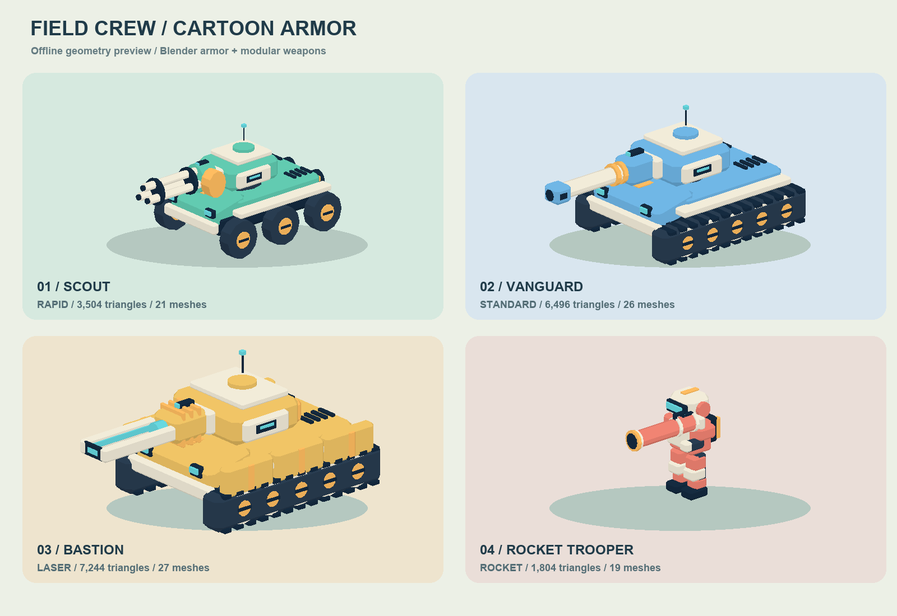

# Blender 卡通机甲与武器



预览由游戏实际加载的模型几何离线投影生成，使用简化光照，不是浏览器游戏截图。

默认外观采用 Blender 制作的四种单位和四种独立武器，保留 16 种组合。奶油白倒角装甲、玩家涂装、深色金属与青色灯带统一风格。

| 单位 | 识别特征 |
|---|---|
| 游隼 / 轻型 | 六轮底盘、窄炮塔、双后推进器 |
| 先锋 / 中型 | 连续履带、倾斜首上装甲、紧凑炮塔 |
| 堡垒 / 重型 | 加厚分段侧裙、宽炮塔、后部弹药舱 |
| 人类 / 装甲兵 | 独立腿部、大头盔与面罩、胸甲、背部能源包 |

| 武器 | 识别特征 |
|---|---|
| 标准炮 | 长炮管、后坐环、方形制退器 |
| 快速炮 | 三管炮、炮管束环、侧置弹鼓 |
| 激光炮 | 双导轨、散热片、发光导体与前端孔径 |
| 火箭筒 | 粗筒身、环形炮口、提把与瞄具 |

## 文件与编辑

- `art/arsenal.blend`：八个模型的可编辑源文件，277,789 字节，约 271 KiB；模型分开放置，保留炮塔、轮组、腿部的层级。
- `client/models/arsenal.json`：网页共用模型库，2,009,764 字节，约 1.92 MiB。使用现有 Three.js ObjectLoader，不新增依赖或贴图。
- `scripts/create-arsenal.py`：建模和导出源脚本。修改脚本后可显式执行下面的命令重新生成，不运行图像渲染。

```sh
/Applications/Blender.app/Contents/MacOS/Blender --background --factory-startup --threads 2 --python scripts/create-arsenal.py
```

**重新生成会覆盖 .blend 和 JSON，不会导出手工编辑过的 .blend。** 手工编辑时请先另存；当前可重复生成路径为修改脚本再执行。脚本关闭本次保存的 .blend1 备份，不改全局已保存偏好。两个模型文件合计约 2.18 MiB；预览约 89 KiB。Docker 排除 art/ 和 docs/，服务器无需安装 Blender。

## 加载、动画与资源预算

`client/model-assets.js` 单次请求并缓存八个原型。单位工厂先显示原程序化模型，库加载成功后使用当前会话实体重建外观；失败或 8 秒超时继续使用原模型。新增且没有对应模型的插件仍走自己的外观钩子。

每个实例拥有独立几何体和涂装材质，销毁不会释放其他玩家或缓存原型的数据。静态外壳按刚性节点和材质合并，轮组用顶点颜色合并，保留旋转关节。16 种组合均少于 8,000 个三角形、最多 30 个可见网格，不含护盾、特效和阴影的额外绘制。

炮塔偏航、武器俯仰与后坐、人类摆腿、车轮转动、护盾、残骸恢复和瞄准变红继续由既有逻辑驱动。武器在 Blender 中沿 -X，基准炮口为 -3.5，由工厂按共享 weaponLength 缩放；人类仍使用原有小型武器安装比例。血量、伤害、射速、射程和权威碰撞体不变。外观三角形不等于命中碰撞体。

原 Three.js 程序化模型与插件钩子保留为加载失败回退，旧预览 `docs/cartoon-lineup.png` 仅表示回退模型。插件配置/版本与协议 v14 不变；外观库不进入联机快照。真实行驶录音保留，见 AUDIO.md。

## 验证与生效

141/141 自动测试通过，包括 16 种 Blender 组合的炮口距离、旋转枢轴、轮心不偏移、有限几何、绘制预算、单次加载、销毁隔离、失败回退及加载期间切换单位。HTTP 替身验证 JSON 返回和发布清单，.blend 不公开。

实际浏览器 WebGL 视觉和帧率尚待验收。源模式重启 Node 后刷新网页即可加载；发布/Docker 模式按 DEPLOY.md 的原流程由部署者重新构建。本轮未运行项目构建、开发服务或 Docker。

## 环境美术

Blender 维修基地的车库、货柜、能源设备和地面标线见 [ENVIRONMENT.md](ENVIRONMENT.md)。

标准炮强化就绪时，在原炮口位置显示橙色光晕，不改 Blender 网格；光晕不参与辅助瞄准，随单位销毁释放资源。

部署恢复策略更新：Redis 默认使用固定前缀 `tiger:rooms:production`，以后无需随协议更新改前缀。已有自定义前缀可保持原值。不兼容检查点备份到 `:checkpoint:previous`（24 小时、最近一份）后启动空大厅；损坏数据、Redis 故障与锁冲突仍报错。单文件构建命令为 `docker-compose build tank`，详见 [DEPLOY.md](DEPLOY.md)。
