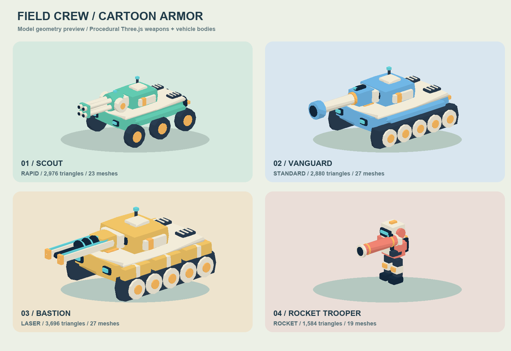

# 程序化卡通外观

本图由当前真实模型几何离线投影生成，采用简化光照，不是浏览器游戏截图。

车体和武器均由 Three.js 基础几何生成，无外部模型文件、贴图或额外模型下载请求。轻型六轮侦察车、中型履带车、重型分段装甲车、人类装甲兵沿用现有卡通造型。

| 武器 | 造型 |
| --- | --- |
| 标准炮 | 粗炮管、加厚炮口护套、上置瞄具 |
| 快速炮 | 四管炮、双侧弹鼓、炮管固定框 |
| 激光炮 | 双导轨、发光线圈、分离的前端护块 |
| 火箭筒 | 粗筒身、环形护套、瞄具与握把 |

造型代码位于四个 `plugins/weapons/*.js`，合计约 5.2 KiB（包含武器参数及注册代码，不包含 Three.js、共用模型工厂和车体代码）。已删除原来的 154 KiB 外部武器顶点数据与导入工具。原始体积统计不是发布压缩后的传输量，也不是显存占用。

静态部分按父节点和材质合并，保留炮塔、俯仰、后坐和人类步行枢轴。16 种组合每款少于 6000 三角形、最多 30 个可见网格；不包含护盾、弹丸、特效和阴影额外绘制。减少下载量不等于帧率保证。

车体和武器同用明亮涂装、奶油白护板、深色炮口及青色发光材质。血量、伤害、射速、射程和简化碰撞体不变。水平静止炮口距离有回归测试；坡上及抬炮外观仍需实际游玩验收。现有真实行驶录音继续保留，见 AUDIO.md。

版本：车体 light/medium/heavy 2.1.1、human 1.0.1；武器 standard/rapid 2.1.2、laser 2.2.2、rocket 1.0.2。协议仍为 v12。更新后重启服务器、刷新所有客户端并新建房间。release/Docker 需要部署者重新构建，本轮未运行构建或开发服务。
